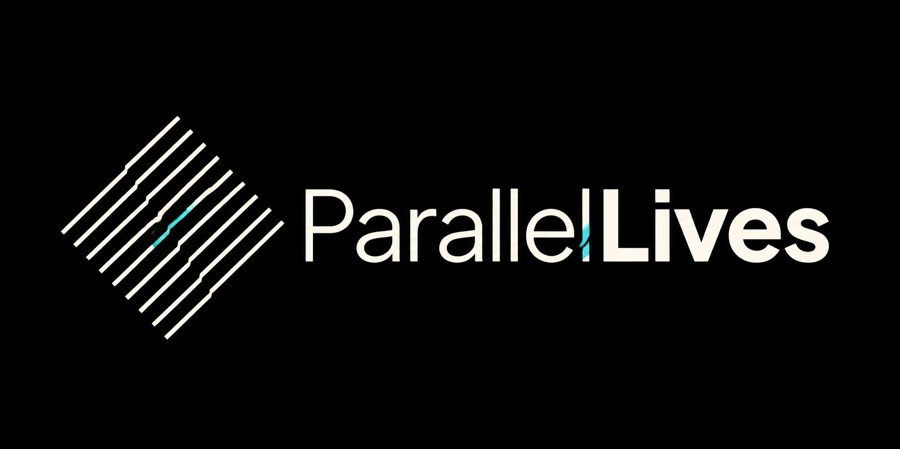

<p align="center">
  
</p>

# ParallelLives

ParallelLives is an experimental electroacoustic instrument for macOS built
around an 8×8 matrix and a bundled Csound engine. Each row is an independent
modular track: the leftmost pad creates one sound source, and each pad added to
its right contributes another ordered processor.

The instrument is designed for timbral movement, physical modelling,
electroacoustic transformation, soundscape performance, and repeatable
improvisation—not note sequencing.

## Download

Download the latest Apple Silicon build from
[GitHub Releases](https://github.com/nzimas/parallel-lives/releases/latest).
The archive contains `ParallelLives.app`; Csound and its required libraries are
already bundled.

Requirements:

- Apple Silicon Mac
- macOS 14 Sonoma or newer
- Novation Launchpad Mini Mk3 recommended; the complete control surface is also
  operable with a trackpad

See the [User Guide](Docs/UserGuide.md) for installation, controller mappings,
projects, scenes, locks, effects, and troubleshooting.

## What it does

- Eight independent left-to-right processing tracks
- Twenty generator archetypes, including Karplus–Strong strings, prepared
  strings, plates, membranes, bowed bodies, reed/bore models, glass, and wood
- Fifteen animated downstream processor families
- Harmonic relationships derived from the first locked generator
- Generator and exact chain-prefix locks
- Per-track volume, pan, random rhythmic gate, and four master-effect sends
- Thirty-two-position Launchpad sliders with four sublevels per pad
- Eight track scenes, 32 global scenes per project, and 32 persistent projects
- Decoupled reverb, delay, saturation/overdrive, and crusher/decimator returns
- Click-safe graph replacement and persistent reverb/delay tails
- Bundled Csound 6.18.1 runtime; no Homebrew or system Csound installation

## Documentation

- [User Guide](Docs/UserGuide.md)
- [Product Definition](Docs/Product.md)
- [Architecture](Docs/Architecture.md)
- [Building and Releasing](Docs/Building.md)
- [Third-party runtime notes](Vendor/Csound/README.md)

## Build from source

The repository includes the pinned macOS Csound runtime closure.

```sh
swift build
Scripts/build-macos-app.sh release
```

The application is written to `dist/ParallelLives.app`.

Run the checks with:

```sh
.build/debug/VascularCoreChecks
python3 Scripts/audit-transitions.py
Scripts/audit-csound-runtime.sh dist/ParallelLives.app
codesign --verify --deep --strict --verbose=2 dist/ParallelLives.app
```

The package and executable retain the historical internal name `Vascular`;
all user-facing surfaces use `ParallelLives`.

## Platform direction

The graph, session, scene, and project types live in a UI-independent Swift
module. macOS is the first host, with iOS and a headless Raspberry Pi controller
target planned. Android will require a platform adapter around the same musical
model and Csound orchestra.

## Third-party software

ParallelLives redistributes Csound 6.18.1 and its runtime dependencies. Their
notices are included in the application bundle and under
[`ThirdPartyNotices`](ThirdPartyNotices/).
